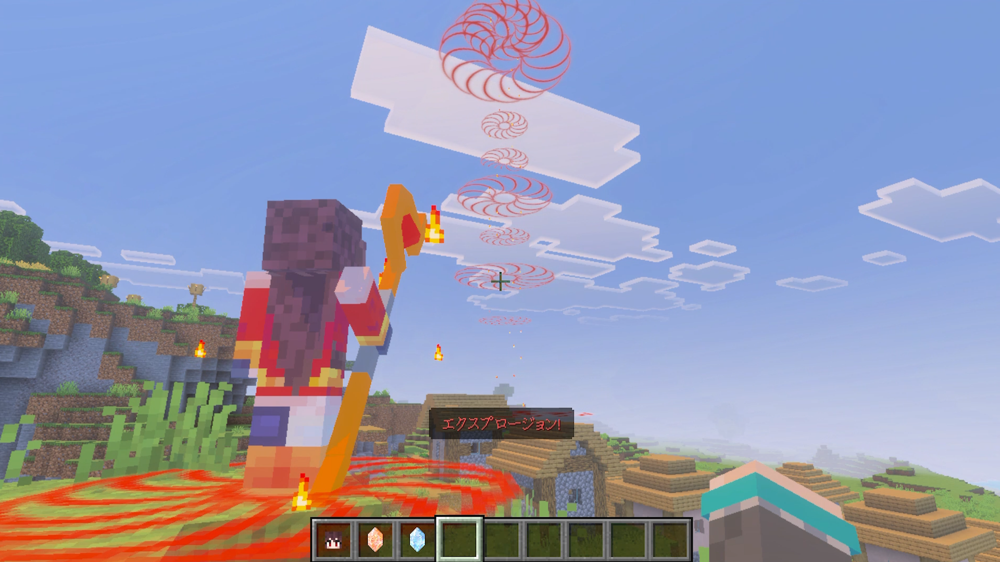

# [add-on]为美好世界献上祝福(?)

本模组为惠惠的法杖add-on重制版，已包含在仓库中

## 「吾名惠惠，乃红魔族第一魔法师，操纵最强爆裂魔法之人！」

加入鬼畜四人组以及对应的技能，所有相关物品均可以从旅商处购买。

### 惠惠-爆裂魔法

互动功能：
- 使用刷怪蛋生成
- 使用厄里斯(素晴货币)驯服(是否驯服和交互功能无关)
- 使用魔力水晶互动指示释放爆裂魔法(使用前先使用标靶指示攻击位置，否则将在原地释放魔法)
- 爆裂魔法释放过后惠惠进入累倒状态，使用魔力水晶恢复

玩家可使用功能：
- 使用惠惠的法杖可释放无吟唱版爆裂魔法

### 阿库娅-神圣驱魔

互动功能：
- 使用刷怪蛋生成
- 使用厄里斯驯服
- 自带驱魔法阵，法阵内非怪物实体快速恢复生命，怪物实体受到持续伤害，亡灵类受到额外伤害

玩家可使用功能：
- 使用阿库娅的法杖召唤临时驱魔法阵，持续10s

### 达克妮斯-剑术(?)

互动功能：
- 使用刷怪蛋生成
- 使用厄里斯驯服
- 可使用剑主动攻击怪物类实体，但伤害堪忧

玩家可使用功能：
- 可使用达克妮斯的剑，伤害高于原版剑类武器，可使用剑类附魔，使用铁锭修复

### 佐藤和真-弓箭

互动功能：
- 使用刷怪蛋生成
- 使用厄里斯驯服
- 主动使用弓箭攻击怪物类实体

玩家可使用功能：
- 吸收之触：获得能量条，能量可被吸收或释放，吸收时优先补充能量条，能量满时改为补充体力，吸收时对附近实体造成伤害；释放时优先消耗能量条，能量空时消耗自身体力，消耗时对附近实体恢复生命
- 偷窃：可对阿库娅，惠惠，达克妮斯使用，使其进入自闭状态(?)，同时有概率获得胖次(??)，对自闭状态三人使用厄里斯互动可恢复正常状态并重置胖次状态(???)